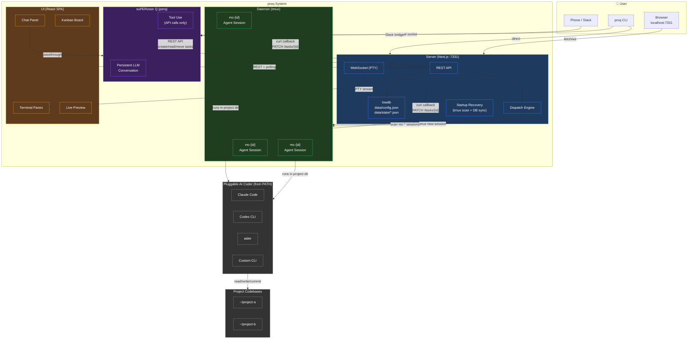
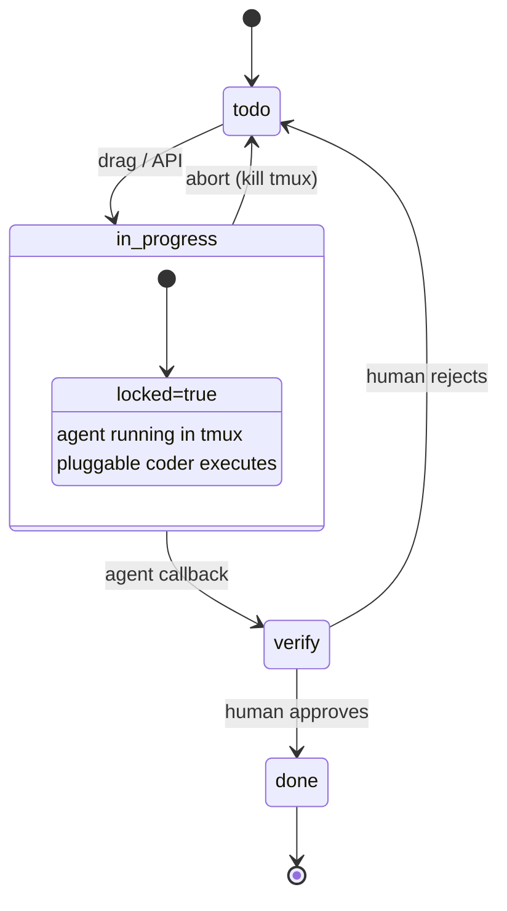

# proq Architecture

## Key Design Rules

| Rule                                     | Enforced By                     |
| ---------------------------------------- | ------------------------------- |
| Server NEVER calls up to Supervisor      | Arrows only go Supervisor → API |
| Agents NEVER talk to Supervisor          | Agents only curl back to API    |
| Supervisor NEVER touches tmux/filesystem | Supervisor only calls REST API  |
| UI is pure client                        | UI only talks to API            |
| Coder is pluggable                       | Detected from PATH at runtime   |
| Server rediscovers state on startup      | Recovery scans tmux + syncs DB  |

## Task Lifecycle

---

Tmux as Process Manager, Socket for I/O

Current Flow

xterm.js → WebSocket → node-pty → [tmux attach -t mc-xxx] →
tmux → coder CLI
^^^^^^^^^^^^^^^^^^^^^^^^^^^
tmux's terminal layer
intercepts
keys, scroll, escape
sequences

Proposed Flow

xterm.js → WebSocket → net.Socket → unix socket → socat → PTY →
coder CLI
/tmp/proq/mc-xxx.sock

tmux still wraps everything (crash survival + process
management)
resize → tmux resize-pane -t mc-xxx -x COLS -y ROWS

What Changes

1. Agent launch wrapper (agent-dispatch.ts)

Instead of tmux running the coder directly, it runs a wrapper
that creates a unix socket bridge:

tmux new-session -d -s mc-xxx -c /project/path \
 "socat UNIX-LISTEN:/tmp/proq/mc-xxx.sock,unlink-early \
 EXEC:'claude --dangerously-skip-permissions
...',pty,setsid,ctty,raw,echo=0"

socat allocates a real PTY for the coder, then exposes it over
a unix socket. tmux wraps the whole thing for crash survival
but never touches the terminal stream.

2. Terminal connection (pty-server.ts)

For task terminals, instead of spawning tmux attach, connect
directly to the socket:

// Before (current)
spawnPty(tabId, `sh -c '... exec tmux attach -t mc-xxx'`)

// After
const sock = net.createConnection('/tmp/proq/mc-xxx.sock')
// Wire sock ↔ WebSocket directly

No node-pty needed for task terminals at all — just a raw
net.Socket.

3. Resize

Use tmux's resize command from the outside (no in-band protocol
needed):

exec(`tmux resize-pane -t mc-xxx -x ${cols} -y ${rows}`)

tmux resizes the pane, which sends SIGWINCH to socat's PTY,
which reaches the coder.

4. Scrollback

Same 50KB ring buffer in pty-server.ts, just reading from the
socket instead of node-pty's onData. No change in behavior.

What Stays the Same

Capability: Enumerate agents
How: tmux ls | grep ^mc-
────────────────────────────────────────
Capability: Kill agent
How: tmux kill-session -t mc-xxx
────────────────────────────────────────
Capability: Check if alive
How: tmux has-session -t mc-xxx
────────────────────────────────────────
Capability: Survive server crash
How: tmux owns the process tree
────────────────────────────────────────
Capability: Cleanup/capture
How: tmux capture-pane still works
────────────────────────────────────────
Capability: User shell terminals
How: Unchanged — still use node-pty directly

What Improves

Issue: Shift-enter not working
Fix: socat PTY passes all keys through natively
────────────────────────────────────────
Issue: Scroll buffer conflicts
Fix: Only one scroll buffer (yours), tmux not involved
────────────────────────────────────────
Issue: Keybinding interception
Fix: No tmux terminal layer in the path
────────────────────────────────────────
Issue: Observability
Fix: Socket close event = process exited. Socket data event =
output arrived. Can pattern-match on output stream for
prompts, submissions, etc.

Risks / Open Questions

- socat availability — installed by default on macOS (brew
  install socat otherwise). Need to document as a dependency or
  bundle an alternative.
- Multiple viewers — current socat UNIX-LISTEN accepts one
  connection. If you want multiple tabs viewing the same agent,
  you'd need socat with fork or a small multiplexer. Could defer
  this.
- Reconnection — if the socket connection drops, need to
  reconnect. Current scrollback replay handles this, but need to
  verify socat keeps the socket listening after disconnect (it
  doesn't with single-client mode — the socket closes when the
  client disconnects, which kills socat and the coder). This is
  the big one — need either fork mode or a wrapper that
  re-listens.

Dependency

socat — one binary, no runtime deps, available on every
platform via package manager. Alternatively, could write a
~50-line Node script that does the same thing (PTY + unix
socket bridge), which removes the external dependency entirely.

Here's the concept for the bridge script. This runs inside the
tmux session:

// proq-bridge.js — runs inside tmux, owns the coder PTY,  
 exposes a unix socket  
 const net = require('net');  
 const pty = require('node-pty');

const SOCKET_PATH = process.argv[2]; // /tmp/proq/mc-xxx.sock
const CODER_CMD = process.argv[3]; // "claude"
const CODER_ARGS = process.argv.slice(4);
const PROJECT_DIR = process.env.PROJECT_DIR;

// Spawn the coder with a real PTY
const proc = pty.spawn(CODER_CMD, CODER_ARGS, {
name: 'xterm-256color',
cols: 120, rows: 30,
cwd: PROJECT_DIR,
});

// Scrollback ring buffer (same as pty-server.ts)
let scrollback = '';
const MAX = 50_000;

proc.onData((data) => {
scrollback += data;
if (scrollback.length > MAX) scrollback =
scrollback.slice(-MAX);
// Forward to connected client, if any
if (client) client.write(data);
});

proc.onExit(({ exitCode }) => {
// Notify any connected client, then exit
if (client) client.write(JSON.stringify({ type: 'exit', code:
exitCode }) + '\n');
setTimeout(() => process.exit(exitCode), 500);
});

// Unix socket server — accepts one client at a time
let client = null;

const server = net.createServer((sock) => {
// Kick previous client if still connected
if (client) client.destroy();
client = sock;

    // Replay scrollback
    sock.write(scrollback);

    // Client → coder
    sock.on('data', (buf) => {
      const str = buf.toString();
      // Simple protocol: JSON lines for control, raw bytes for

input
if (str.startsWith('{"type"')) {
try {
const msg = JSON.parse(str);
if (msg.type === 'resize') proc.resize(msg.cols,
msg.rows);
} catch {}
} else {
proc.write(str);
}
});

    sock.on('close', () => { client = null; });
    sock.on('error', () => { client = null; });

});

// Clean up stale socket, start listening
try { require('fs').unlinkSync(SOCKET_PATH); } catch {}
server.listen(SOCKET_PATH);

What this gives you

- Reconnection — Client disconnects, coder keeps running, next
  connection gets scrollback replay. The critical socat problem
  is gone.
- Resize — In-band JSON message, no exec('tmux resize-pane')
  spawning. Just proc.resize().
- Observability — You can add any event hooks here: pattern
  match on output, detect prompts, emit structured events.
- One dependency — node-pty, which you already have.
- ~60 lines of actual logic.

How it fits in

tmux session runs:
node proq-bridge.js /tmp/proq/mc-xxx.sock claude
--dangerously-skip-permissions ...

pty-server.ts connects:
const sock = net.createConnection('/tmp/proq/mc-xxx.sock')
// wire sock ↔ WebSocket, same as before but simpler

The one awkward part

This script needs node-pty available inside the tmux session.
Since it runs from your proq install directory, it can just
require from your node_modules. But if the coder project is in
a different directory, you'd launch it as:

tmux new-session -d -s mc-xxx -c /project/path \
 "node /path/to/proq/proq-bridge.js /tmp/proq/mc-xxx.sock
claude ..."

Not bad, just means the bridge script path is absolute.

What stays in tmux

Tmux is now just a process container. tmux ls, tmux
kill-session, tmux has-session all still work. The bridge
script + coder die together when the session is killed. Clean.
